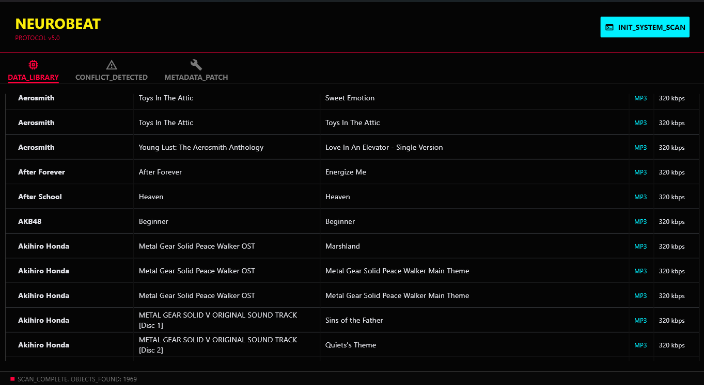
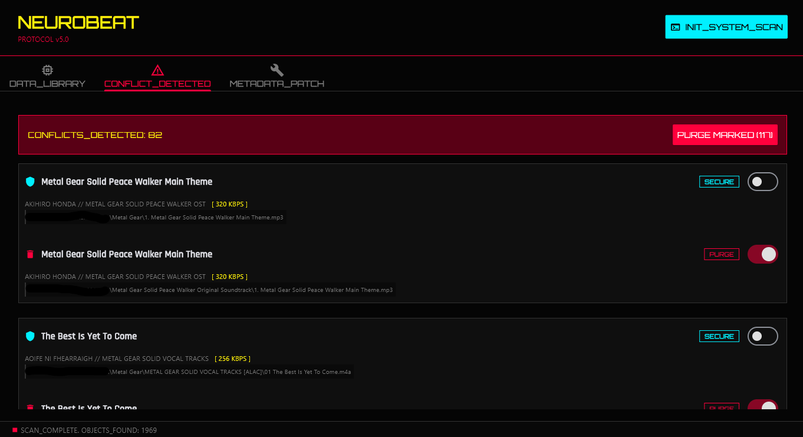
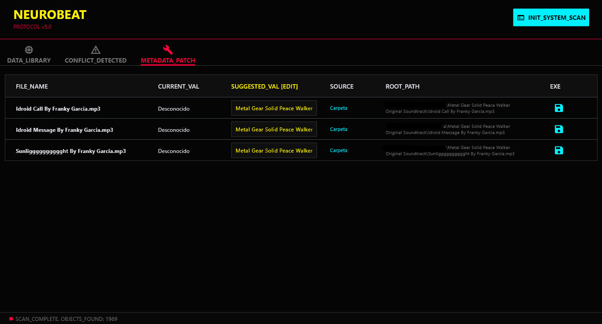

# NeuroBeat Protocol v5.0

**Gestor Avanzado de Bibliotecas Musicales Cyberpunk**

   [](README.md)

**NeuroBeat Protocol** es una potente y visualmente inmersiva aplicación de escritorio diseñada para organizar, limpiar y reparar grandes colecciones locales de música. Desarrollada con Python y Flet, cuenta con una interfaz Cyberpunk inspirada en "Night City" y separa la lógica central de la interfaz de usuario para un rendimiento profesional.

## 📸 Capturas de Pantalla

| **Panel del Sistema** | **Resolución de Conflictos** | **Reparación de Metadata** |
|:---:|:---:|:---:|
|  |  |  |
| *Vista general de la biblioteca con análisis de bitrate* | *Detección inteligente de duplicados con interruptores de seguridad* | *Reparación automática de metadata* |

## Características Principales

### 1. Escaneo Profundo del Sistema (`DATA_LIBRARY`)
*   Escanea recursivamente carpetas y subcarpetas en busca de archivos de audio (`.mp3`, `.flac`, `.wav`, `.ogg`, `.m4a`).
*   Muestra detalles técnicos: **Bitrate**, **Formato** y **Metadatos**.
*   Ordena la jerarquía: Artista → Álbum → Título.

### 2. Detección Inteligente de Conflictos (`CONFLICT_DETECTED`)
*   **Lógica Difusa:** Identifica duplicados basándose en combinaciones normalizadas de Artista/Título.
*   **Calidad Primero:** Sugiere automáticamente conservar la versión de mayor calidad (mayor bitrate/duración) y marca las copias de menor calidad para su eliminación.
*   **"Purge" vs "Secure":** Interruptores interactivos para anular manualmente la decisión de eliminación.
*   **Red de Seguridad:** Los archivos eliminados se envían a la **Papelera de Reciclaje del SO** (vía `Send2Trash`), no se destruyen permanentemente.

### 3. Reparación de Metadatos (`METADATA_PATCH`)
*   **Auto-Inferencia:** Detecta etiquetas de Artista faltantes y las deduce de:
    *   La etiqueta "Album Artist" (Artista del Álbum).
    *   El nombre de la Carpeta Padre.
*   **Edición en Línea:** Edita el nombre del artista sugerido directamente dentro de la tabla antes de aplicar los cambios.
*   **Capacidad de Escritura:** Utiliza `Mutagen` para escribir permanentemente las etiquetas corregidas en los archivos de audio.

### 4. UI/UX Cyberpunk
*   **Tema:** Modo oscuro con acentos en Rojo Neón/Cyan (Estilo "Arasaka").
*   **Tipografía:** Integración con Google Fonts (`Orbitron` para encabezados, `Rajdhani` para el cuerpo, `Roboto Mono` para datos).
*   **Adaptabilidad:** Diseño fluido construido con Flet.

---

## Instalación

### Requisitos Previos
*   Python 3.14 instalado.

### 1. Clonar o Descargar
Descarga los archivos del proyecto en tu máquina local.

### 2. Instalar Dependencias
Ejecuta el siguiente comando en tu terminal para instalar las librerías necesarias:


```bash
pip install flet mutagen send2trash
```
---

## Cómo Ejecutar

1. Navega a la carpeta del proyecto.
2. Ejecuta el archivo de la interfaz principal.
```bash
python main_flet.py
```
3. Haz clic en `INIT_SYSTEM_SCAN` y selecciona tu carpeta de música.
---

## Estructura del Proyecto
El proyecto sigue una arquitectura modular de Separación de Responsabilidades:

```text
/NeuroBeat-Protocol
│
├── assets/                  # Carpeta de recursos
│   ├── icon.png             # Icono de ventana (Logo de la App)
│   └── screenshots/         # Capturas de pantalla para el README
│       ├── library_view.png
│       ├── duplicates_view.png
│       └── repair_view.png
│
├── main_flet.py             # FRONTEND: Contiene solo código de UI (Flet)
├── music_logic.py           # BACKEND: Contiene escaneo, etiquetado y operaciones de archivo
└── README.md                # Documentación
```
---

## Guía de Uso

### 1. Escaneo
Haz clic en el botón cian `INIT_SYSTEM_SCAN` en la parte superior derecha. Selecciona tu directorio raíz de música. La barra de progreso indicará el estado del escaneo.

### 2. Gestión de Duplicados
Ve a la pestaña `CONFLICT_DETECTED`.

* El sistema agrupa los duplicados.
* Rojo (PURGE): Marcado para eliminación.
* Cian (SECURE): Marcado para conservar.
* Alterna el interruptor para cambiar la acción.
* Haz clic en `PURGE MARKED` para mover los archivos seleccionados a la Papelera. La biblioteca se actualiza automáticamente.

### Reparación de Etiquetas
Ve a la pestaña `METADATA_PATCH`.

* Revisa los archivos con etiquetas de Artista faltantes.
* **Editar:** Haz clic en el campo de texto en la columna "Suggested" para corregir manualmente el nombre.
* **Guardar:** Haz clic en el icono del disquete para escribir la etiqueta en el archivo.

---

## Mecanismos de Seguridad

* **Papelera de Reciclaje:** Esta aplicación utiliza la librería `Send2Trash`. Nunca ejecuta un `os.remove` permanente. Siempre puedes restaurar archivos desde la papelera de tu sistema.
* **Solo Lectura por Defecto:** El escaneo es de solo lectura hasta que explícitamente haces clic en "Purge" o "Save".

---

## Créditos
Desarrollado con Python y Flet.

* **Motor de UI:** [Flet](https://flet.dev/)
* **Manejo de Audio:** [Mutagen](https://mutagen.readthedocs.io/en/latest/)

---

## 🤝 Contribuciones

Las contribuciones son las que hacen de la comunidad de código abierto un lugar increíble para aprender, inspirar y crear. Cualquier contribución que hagas es **muy apreciada**.

1.  Haz un Fork del Proyecto
2.  Crea tu Rama de Funcionalidad (`git checkout -b feature/AmazingFeature`)
3.  Haz Commit de tus Cambios (`git commit -m 'Add some AmazingFeature'`)
4.  Haz Push a la Rama (`git push origin feature/AmazingFeature`)
5.  Abre un Pull Request

---

## 📄 Licencia

Distribuido bajo la Licencia MIT. Esto significa que puedes usar, copiar, modificar, fusionar, publicar, distribuir, sublicenciar y/o vender copias del software.

---

## 📞 Contacto

**Líder del Proyecto** - Alejandro Giraldo

Enlace del Proyecto: [https://github.com/Malegiraldo22/NeuroBeat-Protocol](https://github.com/Malegiraldo22/NeuroBeat-Protocol)

---

<div align="center">
  <p><i>"Wake up, Samurai. We have a library to burn."</i></p>
  
</div>